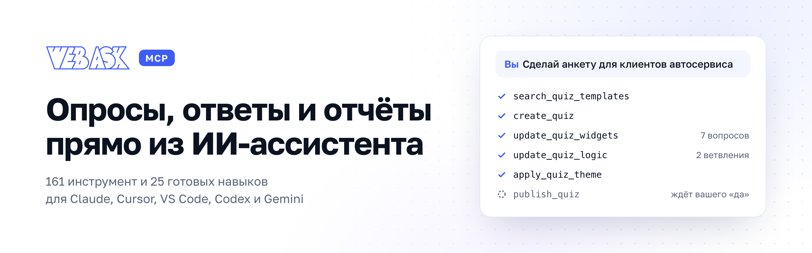

<p align="center">
  <picture>
    <source media="(prefers-color-scheme: dark)" srcset="assets/banner-dark.png">
    
  </picture>
</p>

<p align="center">
  <a href="#быстрый-старт"><b>Быстрый старт</b></a>&nbsp;&nbsp;·&nbsp;&nbsp;<a href="#навыки"><b>25 навыков</b></a>&nbsp;&nbsp;·&nbsp;&nbsp;<a href="docs/tools.md"><b>161 инструмент</b></a>&nbsp;&nbsp;·&nbsp;&nbsp;<a href="docs/prompts.md"><b>Что попросить</b></a>&nbsp;&nbsp;·&nbsp;&nbsp;<a href="en/README.md"><b>English</b></a>
</p>

<p align="center">
  <a href="https://webask.io/skills"></a>
  <a href="docs/tools.md"></a>
  
  <a href="LICENSE"></a>
</p>

MCP-сервер [WebAsk](https://webask.io) и готовые навыки (skills) для ИИ-ассистента. Ассистент соберёт
анкету по описанию, проверит её перед запуском, прочитает ответы и сделает отчёт для заказчика. Вы только
говорите, что нужно.

Работает с Claude Code, Claude Desktop, Cursor, VS Code, Codex и Gemini CLI.

```text
Вы:  Сделай анкету для клиентов автосервиса: оценить работу и собрать контакты
     для повторной записи.
ИИ:  ✓ подобрал типы вопросов  ✓ собрал 7 вопросов и 2 ветвления  ✓ применил тему
     Черновик готов, пока его видите только вы. Публикуем?
```

## Быстрый старт

1. **Создайте ключ.** В кабинете WebAsk откройте **Настройки → API / MCP** и нажмите «Создать API-ключ».
   Ключ показывается один раз, сохраните его сразу.
2. **Подключите сервер** `https://mcp.webask.io/mcp/v1` к ассистенту. Готовые команды и конфиги ниже.
3. **Попросите:** «Покажи мои опросы и сколько ответов пришло за неделю».

### Claude Code: всё одной установкой

Плагин ставит MCP-сервер и все 25 навыков сразу. Ключ Claude Code спросит при установке и сохранит
в системном хранилище паролей.

```text
/plugin marketplace add WebAskio/webask-mcp
/plugin install webask@webask
```

Если нужен только сервер, без навыков:

```bash
claude mcp add --transport http webask https://mcp.webask.io/mcp/v1 \
  --header "Authorization: Bearer YOUR_API_KEY"
```

### Другие клиенты

В конфигах ниже замените `YOUR_API_KEY` на свой ключ.

<details>
<summary><b>Claude Desktop</b></summary>

<br>

**Settings → Developer → Edit Config**, в файл `claude_desktop_config.json`. Нужен установленный Node.js:
его использует [mcp-remote](https://github.com/geelen/mcp-remote), он передаёт ключ серверу.

```json
{
  "mcpServers": {
    "webask": {
      "command": "npx",
      "args": ["-y", "mcp-remote", "https://mcp.webask.io/mcp/v1", "--header", "Authorization:${WEBASK_AUTH}"],
      "env": { "WEBASK_AUTH": "Bearer YOUR_API_KEY" }
    }
  }
}
```

После сохранения перезапустите Claude Desktop.

</details>

<details>
<summary><b>Cursor</b></summary>

<br>

**Settings → MCP → Add new global MCP server**, или напрямую в файл `~/.cursor/mcp.json`:

```json
{
  "mcpServers": {
    "webask": {
      "url": "https://mcp.webask.io/mcp/v1",
      "headers": { "Authorization": "Bearer YOUR_API_KEY" }
    }
  }
}
```

</details>

<details>
<summary><b>VS Code</b></summary>

<br>

Файл `.vscode/mcp.json` в проекте. Ключ VS Code спросит при первом запуске и сохранит у себя, в файле его
не будет:

```json
{
  "inputs": [
    { "type": "promptString", "id": "webask-api-key", "description": "WebAsk API key", "password": true }
  ],
  "servers": {
    "webask": {
      "type": "http",
      "url": "https://mcp.webask.io/mcp/v1",
      "headers": { "Authorization": "Bearer ${input:webask-api-key}" }
    }
  }
}
```

</details>

<details>
<summary><b>Codex</b></summary>

<br>

В файл `~/.codex/config.toml`:

```toml
[mcp_servers.webask]
url = "https://mcp.webask.io/mcp/v1"
bearer_token_env_var = "WEBASK_API_KEY"
```

Ключ Codex берёт из переменной окружения: `export WEBASK_API_KEY=YOUR_API_KEY`.

</details>

<details>
<summary><b>Gemini CLI</b></summary>

<br>

В файл `~/.gemini/settings.json`:

```json
{
  "mcpServers": {
    "webask": {
      "httpUrl": "https://mcp.webask.io/mcp/v1",
      "headers": { "Authorization": "Bearer YOUR_API_KEY" }
    }
  }
}
```

</details>

Те же конфиги отдельными файлами лежат в [`clients/`](clients/), пошаговая инструкция — в
[`docs/connect.md`](docs/connect.md).

## Что это такое

| | |
|---|---|
| **Адрес сервера** | `https://mcp.webask.io/mcp/v1` |
| **Транспорт** | Streamable HTTP, на своей стороне ничего разворачивать не нужно |
| **Авторизация** | API-ключ в заголовке `Authorization: Bearer …` |
| **Инструменты** | 161: 57 только читают, 24 — необратимые, сервер их помечает. [Весь список](docs/tools.md) |
| **Права** | Те же, что в конструкторе: роль участника и тариф пространства |
| **Лимиты** | 180 запросов в минуту, ссылки на выгрузки действуют час |

## Что умеет

**Опросы.** Собрать опрос по описанию или из шаблона, настроить вопросы, ветвления, переменные и скрытые
поля. Применить тему, опубликовать, вернуть прошлую версию.

**Раздача.** Ссылка, QR-код, пароль на опрос, версия для печати, промокоды, онлайн-запись с расписанием.

**Ответы.** Прочитать, разметить тегами и заметками, скрыть лишнее, убрать тестовые.

**Отчёты.** Сводка, отчёт с фильтрами, AI-отчёт, публичные ссылки для заказчика. Выгрузки в Excel, CSV,
SPSS, Word и PDF.

**Заявки.** Уведомления на почту и свой SMTP, вебхуки с журналом доставки, CRM и amoCRM, Google Таблицы,
мессенджеры, Zapier.

**Аккаунт.** Участники и роли, папки и доступ к ним, брендинг, свой домен, файлы и хранилище.

Инструменты по разделам — в [`docs/tools.md`](docs/tools.md), готовые фразы — в [`docs/prompts.md`](docs/prompts.md).

## Навыки

Навык — готовая методика для ассистента. Вы просите «разбери открытые ответы», а навык подсказывает, какие
инструменты вызвать, в каком порядке и как показать результат. Кода в навыках нет, это текстовые инструкции:
ничего не устанавливается и не запускается.

### Собрать и раздать

| Навык | Что даёт | Скачать |
|---|---|:-:|
| [Сборка опроса по описанию](skills/webask-quiz-from-brief/) | Опишите задачу словами — получите готовый опрос, а не список вопросов | [ZIP](https://github.com/WebAskio/webask-mcp/releases/download/skills-latest/webask-quiz-from-brief.zip) |
| [Переписать формулировки](skills/webask-quiz-copy/) | Переписывает вопросы так, чтобы опрос дочитывали, — и начинает с данных, а не со вкуса | [ZIP](https://github.com/WebAskio/webask-mcp/releases/download/skills-latest/webask-quiz-copy.zip) |
| [Логика показа и маршруты](skills/webask-quiz-logic/) | Собирает ветвление так, чтобы ни один респондент не упёрся в тупик | [ZIP](https://github.com/WebAskio/webask-mcp/releases/download/skills-latest/webask-quiz-logic.zip) |
| [Материалы для запуска](skills/webask-launch-kit/) | Собирает всё для запуска разом: ссылки с метками, тексты анонса и QR-код | [ZIP](https://github.com/WebAskio/webask-mcp/releases/download/skills-latest/webask-launch-kit.zip) |
| [Раздача опроса](skills/webask-quiz-distribution/) | Готовит опрос к раздаче так, чтобы потом было видно, из какого канала пришли ответы | [ZIP](https://github.com/WebAskio/webask-mcp/releases/download/skills-latest/webask-quiz-distribution.zip) |

### Проверить перед запуском

| Навык | Что даёт | Скачать |
|---|---|:-:|
| [Проверка опроса перед запуском](skills/webask-prelaunch-check/) | Находит то, что сломается на живых респондентах, пока ссылку ещё никому не отправили | [ZIP](https://github.com/WebAskio/webask-mcp/releases/download/skills-latest/webask-prelaunch-check.zip) |
| [Качество собранных данных](skills/webask-data-quality/) | Отвечает, можно ли верить этим данным, до того как на них построят выводы | [ZIP](https://github.com/WebAskio/webask-mcp/releases/download/skills-latest/webask-data-quality.zip) |

### Понять результаты

| Навык | Что даёт | Скачать |
|---|---|:-:|
| [Разбор результатов опроса](skills/webask-results-digest/) | Отвечает на «ну и что там по опросу» цифрами с выводом, а не выгрузкой сырых ответов | [ZIP](https://github.com/WebAskio/webask-mcp/releases/download/skills-latest/webask-results-digest.zip) |
| [Анализ A/B-вариантов](skills/webask-ab-significance/) | Отвечает, реальна разница между вариантами или это случайность | [ZIP](https://github.com/WebAskio/webask-mcp/releases/download/skills-latest/webask-ab-significance.zip) |
| [Сравнение с собой прошлым](skills/webask-benchmark/) | Сравнивает опрос с ним же прошлым: отдельная цифра ничего не значит, разница — значит | [ZIP](https://github.com/WebAskio/webask-mcp/releases/download/skills-latest/webask-benchmark.zip) |
| [Разбор свободных ответов](skills/webask-open-answers/) | Превращает сотню строк свободного текста в несколько тем с числами и цитатами | [ZIP](https://github.com/WebAskio/webask-mcp/releases/download/skills-latest/webask-open-answers.zip) |
| [Воронка прохождения](skills/webask-response-funnel/) | Показывает, на каком вопросе люди закрывают вкладку — и почему | [ZIP](https://github.com/WebAskio/webask-mcp/releases/download/skills-latest/webask-response-funnel.zip) |
| [Сколько ответов нужно](skills/webask-sample-oracle/) | Отвечает, хватает ли уже собранного и сколько ещё нужно, чтобы выводы не развернулись | [ZIP](https://github.com/WebAskio/webask-mcp/releases/download/skills-latest/webask-sample-oracle.zip) |
| [Хронология опроса](skills/webask-quiz-timeline/) | Отвечает на «почему перестали приходить ответы», сопоставляя сбор с историей правок | [ZIP](https://github.com/WebAskio/webask-mcp/releases/download/skills-latest/webask-quiz-timeline.zip) |
| [Сравнение источников](skills/webask-source-dashboard/) | Показывает, какой канал привёл людей, а какой — только цифры | [ZIP](https://github.com/WebAskio/webask-mcp/releases/download/skills-latest/webask-source-dashboard.zip) |
| [Результаты — заказчику](skills/webask-results-sharing/) | Собирает результаты в то, что можно отправить: ссылку, файл или отчёт с выводами | [ZIP](https://github.com/WebAskio/webask-mcp/releases/download/skills-latest/webask-results-sharing.zip) |
| [Оформление отчётов и тема опроса](skills/webask-report-appearance/) | Приводит в порядок то, что видят снаружи: тему опроса, палитру отчётов и логотип | [ZIP](https://github.com/WebAskio/webask-mcp/releases/download/skills-latest/webask-report-appearance.zip) |

### Довести заявки

| Навык | Что даёт | Скачать |
|---|---|:-:|
| [Уведомления о новых ответах](skills/webask-answer-notifications/) | Настраивает, куда сообщать о новых ответах, и чинит, когда сообщать перестало | [ZIP](https://github.com/WebAskio/webask-mcp/releases/download/skills-latest/webask-answer-notifications.zip) |
| [Настройка вебхука](skills/webask-webhook-setup/) | Заводит отправку ответов на ваш адрес и сразу проверяет, что приёмник их принял | [ZIP](https://github.com/WebAskio/webask-mcp/releases/download/skills-latest/webask-webhook-setup.zip) |
| [Почему ответы не уходят](skills/webask-integration-triage/) | Находит, почему заявки не доходят до CRM, Telegram или таблицы — и что с этим делать | [ZIP](https://github.com/WebAskio/webask-mcp/releases/download/skills-latest/webask-integration-triage.zip) |
| [Качество заявок](skills/webask-lead-quality/) | Считает не завершаемость, а сколько людей оставили пригодный контакт | [ZIP](https://github.com/WebAskio/webask-mcp/releases/download/skills-latest/webask-lead-quality.zip) |

### Порядок в аккаунте

| Навык | Что даёт | Скачать |
|---|---|:-:|
| [Аудит аккаунта](skills/webask-account-audit/) | Показывает одним отчётом, где аккаунт теряет ответы, место и деньги | [ZIP](https://github.com/WebAskio/webask-mcp/releases/download/skills-latest/webask-account-audit.zip) |
| [Порядок в ответах](skills/webask-answers-cleanup/) | Убирает тестовые прохождения и дубли, но сначала показывает, что именно попадёт под чистку | [ZIP](https://github.com/WebAskio/webask-mcp/releases/download/skills-latest/webask-answers-cleanup.zip) |
| [Порядок в аккаунте](skills/webask-workspace-housekeeping/) | Навык разберёт накопившиеся опросы, сохранит ответы и покажет план изменений до того, как что-либо поменяет. | [ZIP](https://github.com/WebAskio/webask-mcp/releases/download/skills-latest/webask-workspace-housekeeping.zip) |
| [Участники и доступы](skills/webask-workspace-access/) | Разбирается, почему участник не видит опросы, и выдаёт ровно те права, что нужны | [ZIP](https://github.com/WebAskio/webask-mcp/releases/download/skills-latest/webask-workspace-access.zip) |

Все навыки одним архивом: [webask-skills-ru.zip](https://github.com/WebAskio/webask-mcp/releases/download/skills-latest/webask-skills-ru.zip). Витрина с примерами результата —
[webask.io/skills](https://webask.io/skills).

### Как поставить навык без плагина

Распакуйте архив в папку, из которой ваш ассистент читает навыки, и перезапустите его.

| Ассистент | Папка в проекте |
|---|---|
| Claude Code | `.claude/skills/` |
| Codex, Cursor | `.agents/skills/` |
| Gemini CLI | `.gemini/skills/` |

Вашего ассистента нет в таблице? Попробуйте `.agents/skills/`, эту папку понимает большинство клиентов.
Подробности — в [`skills/README.md`](skills/README.md).

## Безопасность

- Ключ даёт ассистенту те же права, что у вас в пространстве. Отозвать его можно в любой момент:
  **Настройки → API / MCP**.
- Необратимые инструменты — удаление опросов, чистка ответов и подобное — сервер помечает аннотацией
  `destructiveHint`, чтобы клиент видел, что вызов не отменить.
- В каждом навыке есть раздел «Чего не делать»: что ассистенту нельзя делать без вашего слова.
- Секретов в репозитории нет и не должно быть: в конфигах вместо ключа стоит `YOUR_API_KEY`.
  Нашли что-то похожее на настоящий ключ — напишите нам, см. [SECURITY.md](SECURITY.md).

## Ссылки

- [Витрина навыков](https://webask.io/skills)
- [Документация MCP-сервера](https://webask.io/dev/api/mcp)
- [Поддержка](https://webask.io/support)
- [Telegram](https://t.me/webask) · [VK](https://vk.com/webask) · [MAX](https://max.ru/id9702003601_biz)

## Лицензия

MIT, см. [LICENSE](LICENSE). Лицензия распространяется на содержимое репозитория: документацию, конфиги и
навыки. Сам сервис WebAsk работает по [пользовательскому соглашению](https://webask.io/agreement).
