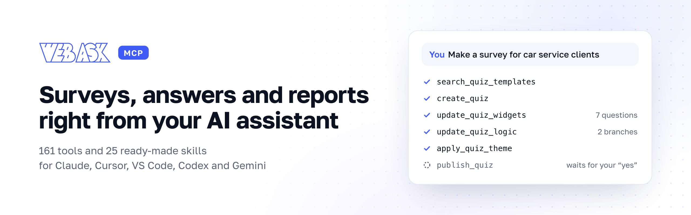

<p align="center">
  <picture>
    <source media="(prefers-color-scheme: dark)" srcset="../assets/banner-en-dark.png">
    
  </picture>
</p>

<p align="center">
  <a href="#quick-start"><b>Quick start</b></a>&nbsp;&nbsp;·&nbsp;&nbsp;<a href="#skills"><b>25 skills</b></a>&nbsp;&nbsp;·&nbsp;&nbsp;<a href="docs/tools.md"><b>161 tools</b></a>&nbsp;&nbsp;·&nbsp;&nbsp;<a href="docs/prompts.md"><b>What to ask</b></a>&nbsp;&nbsp;·&nbsp;&nbsp;<a href="../README.md"><b>Русский</b></a>
</p>

<p align="center">
  
  <a href="docs/tools.md"></a>
  
  <a href="../LICENSE"></a>
</p>

The [WebAsk](https://webask.io) MCP server plus ready-made skills for your AI assistant. It builds a survey
from a plain-language brief, checks it before launch, reads the answers and prepares a report for your
client. You just say what you need.

Works with Claude Code, Claude Desktop, Cursor, VS Code, Codex and Gemini CLI.

```text
You:  Make a feedback form for car service customers: rate the work and collect
      contacts for a repeat visit.
AI:   ✓ picked question types  ✓ built 7 questions and 2 branches  ✓ applied a theme
      The draft is ready and only you can see it. Publish?
```

## Quick start

1. **Create a key.** In your WebAsk account open **Settings → API / MCP** and click “Create API key”.
   The key is shown once, so save it right away.
2. **Connect the server** `https://mcp.webask.io/mcp/v1` to your assistant. Commands and configs are below.
3. **Ask:** “Show my surveys and how many answers came in this week.”

### Claude Code: one install for everything

The plugin installs the MCP server and all 25 skills at once. Claude Code asks for your key during
installation and keeps it in the system keychain.

```text
/plugin marketplace add WebAskio/webask-mcp
/plugin install webask-en@webask
```

Only the server, without skills:

```bash
claude mcp add --transport http webask https://mcp.webask.io/mcp/v1 \
  --header "Authorization: Bearer YOUR_API_KEY"
```

### Other clients

One click:

[](https://vscode.dev/redirect/mcp/install?name=webask&inputs=%5B%7B%22type%22%3A%22promptString%22%2C%22id%22%3A%22webask_api_key%22%2C%22description%22%3A%22WebAsk%20API%20key%3A%20Settings%20%E2%86%92%20API%20%2F%20MCP%22%2C%22password%22%3Atrue%7D%5D&config=%7B%22type%22%3A%22http%22%2C%22url%22%3A%22https%3A%2F%2Fmcp.webask.io%2Fmcp%2Fv1%22%2C%22headers%22%3A%7B%22Authorization%22%3A%22Bearer%20%24%7Binput%3Awebask_api_key%7D%22%7D%7D)
[](https://cursor.com/en/install-mcp?name=webask&config=eyJ1cmwiOiJodHRwczovL21jcC53ZWJhc2suaW8vbWNwL3YxIiwiaGVhZGVycyI6eyJBdXRob3JpemF0aW9uIjoiQmVhcmVyIFlPVVJfQVBJX0tFWSJ9fQ%3D%3D)

VS Code asks for the key itself. In Cursor, open the `webask` server settings after installing and
replace `YOUR_API_KEY` with your key.

Manually: replace `YOUR_API_KEY` with your key in the configs below.

<details>
<summary><b>Claude Desktop</b></summary>

<br>

**Settings → Developer → Edit Config**, file `claude_desktop_config.json`. Requires Node.js: it runs
[mcp-remote](https://github.com/geelen/mcp-remote), which passes your key to the server.

```json
{
  "mcpServers": {
    "webask": {
      "command": "npx",
      "args": ["-y", "mcp-remote", "https://mcp.webask.io/mcp/v1", "--header", "Authorization:${WEBASK_AUTH}"],
      "env": { "WEBASK_AUTH": "Bearer YOUR_API_KEY" }
    }
  }
}
```

Restart Claude Desktop after saving.

</details>

<details>
<summary><b>Cursor</b></summary>

<br>

**Settings → MCP → Add new global MCP server**, or edit `~/.cursor/mcp.json` directly:

```json
{
  "mcpServers": {
    "webask": {
      "url": "https://mcp.webask.io/mcp/v1",
      "headers": { "Authorization": "Bearer YOUR_API_KEY" }
    }
  }
}
```

</details>

<details>
<summary><b>VS Code</b></summary>

<br>

File `.vscode/mcp.json` in your project. VS Code asks for the key on first start and stores it itself, so
the key never lands in the file:

```json
{
  "inputs": [
    { "type": "promptString", "id": "webask-api-key", "description": "WebAsk API key", "password": true }
  ],
  "servers": {
    "webask": {
      "type": "http",
      "url": "https://mcp.webask.io/mcp/v1",
      "headers": { "Authorization": "Bearer ${input:webask-api-key}" }
    }
  }
}
```

</details>

<details>
<summary><b>Codex</b></summary>

<br>

In `~/.codex/config.toml`:

```toml
[mcp_servers.webask]
url = "https://mcp.webask.io/mcp/v1"
bearer_token_env_var = "WEBASK_API_KEY"
```

Codex reads the key from the environment: `export WEBASK_API_KEY=YOUR_API_KEY`.

</details>

<details>
<summary><b>Gemini CLI</b></summary>

<br>

As an extension, with the server and the skills at once (Gemini asks for the key during installation).
The extension ships the Russian skills; for English ones use `npx skills` below:

```bash
gemini extensions install https://github.com/WebAskio/webask-mcp
```

Or the server only, in `~/.gemini/settings.json`:

```json
{
  "mcpServers": {
    "webask": {
      "httpUrl": "https://mcp.webask.io/mcp/v1",
      "headers": { "Authorization": "Bearer YOUR_API_KEY" }
    }
  }
}
```

</details>

The same configs as separate files are in [`clients/`](../clients/), step by step in
[`docs/connect.md`](docs/connect.md).

## At a glance

| | |
|---|---|
| **Server URL** | `https://mcp.webask.io/mcp/v1` |
| **Transport** | Streamable HTTP, nothing to deploy on your side |
| **Auth** | API key in the `Authorization: Bearer …` header |
| **Tools** | 161: 57 read-only, 24 destructive and annotated. [Full list](docs/tools.md) |
| **Permissions** | Same as in the builder: the member's role and the workspace plan |
| **Limits** | 180 requests per minute, export links live for one hour |

## What it can do

**Surveys.** Build a survey from a brief or a template, set up questions, branching, variables and hidden
fields. Apply a theme, publish, roll back to an earlier version.

**Sharing.** Link, QR code, password, printable version, promo codes, online booking with schedules.

**Answers.** Read, tag and annotate, hide what's irrelevant, clean out test entries.

**Reports.** Summary, filtered report, AI report, public links for your client. Exports to Excel, CSV,
SPSS, Word and PDF.

**Leads.** Email notifications and your own SMTP, webhooks with a delivery log, CRM and amoCRM, Google
Sheets, messengers, Zapier.

**Account.** Members and roles, folders and access, branding, custom domain, files and storage.

Tools by section are in [`docs/tools.md`](docs/tools.md), starter phrases in [`docs/prompts.md`](docs/prompts.md).

## Skills

A skill is a ready-made playbook for the assistant. You ask “sort out the open-ended answers”, and the skill
tells it which tools to call, in what order and how to present the result. Skills contain no code, just
text instructions: nothing gets installed or executed.

### Build and share

| Skill | What you get | Download |
|---|---|:-:|
| [Build a survey from a brief](skills/webask-quiz-from-brief/) | Describe the job in plain words and get a working survey, not a list of questions | [ZIP](https://github.com/WebAskio/webask-mcp/releases/download/skills-latest/webask-quiz-from-brief-en.zip) |
| [Rewriting survey copy](skills/webask-quiz-copy/) | Rewrites questions so people finish — starting from the data, not from taste | [ZIP](https://github.com/WebAskio/webask-mcp/releases/download/skills-latest/webask-quiz-copy-en.zip) |
| [Branching and routing](skills/webask-quiz-logic/) | Builds branching so that no respondent ever hits a dead end | [ZIP](https://github.com/WebAskio/webask-mcp/releases/download/skills-latest/webask-quiz-logic-en.zip) |
| [Launch kit](skills/webask-launch-kit/) | Puts the whole launch together at once: tagged links, announcement copy and a QR code | [ZIP](https://github.com/WebAskio/webask-mcp/releases/download/skills-latest/webask-launch-kit-en.zip) |
| [Distributing the survey](skills/webask-quiz-distribution/) | Gets the survey ready to hand out so you can still tell which channel each response came from | [ZIP](https://github.com/WebAskio/webask-mcp/releases/download/skills-latest/webask-quiz-distribution-en.zip) |

### Check before launch

| Skill | What you get | Download |
|---|---|:-:|
| [Pre-launch check](skills/webask-prelaunch-check/) | Finds what will break on real respondents while the link is still unsent | [ZIP](https://github.com/WebAskio/webask-mcp/releases/download/skills-latest/webask-prelaunch-check-en.zip) |
| [Data quality check](skills/webask-data-quality/) | Answers whether this data can be trusted before anyone builds conclusions on it | [ZIP](https://github.com/WebAskio/webask-mcp/releases/download/skills-latest/webask-data-quality-en.zip) |

### Understand the results

| Skill | What you get | Download |
|---|---|:-:|
| [What the survey showed](skills/webask-results-digest/) | Answers «so what did the survey say» with figures and a conclusion, not a raw export | [ZIP](https://github.com/WebAskio/webask-mcp/releases/download/skills-latest/webask-results-digest-en.zip) |
| [A/B variant analysis](skills/webask-ab-significance/) | Tells you whether the difference between variants is real or just noise | [ZIP](https://github.com/WebAskio/webask-mcp/releases/download/skills-latest/webask-ab-significance-en.zip) |
| [Comparing with past results](skills/webask-benchmark/) | Compares the survey with its own past: one figure means nothing, a change does | [ZIP](https://github.com/WebAskio/webask-mcp/releases/download/skills-latest/webask-benchmark-en.zip) |
| [Analysing free-text answers](skills/webask-open-answers/) | Turns a hundred lines of free text into a handful of themes with numbers and quotes | [ZIP](https://github.com/WebAskio/webask-mcp/releases/download/skills-latest/webask-open-answers-en.zip) |
| [Completion funnel](skills/webask-response-funnel/) | Shows which question makes people close the tab — and why | [ZIP](https://github.com/WebAskio/webask-mcp/releases/download/skills-latest/webask-response-funnel-en.zip) |
| [How many responses are needed](skills/webask-sample-oracle/) | Says whether what you have is enough and how much more you need before conclusions hold | [ZIP](https://github.com/WebAskio/webask-mcp/releases/download/skills-latest/webask-sample-oracle-en.zip) |
| [Survey timeline](skills/webask-quiz-timeline/) | Answers «why did responses stop» by lining up collection against the edit history | [ZIP](https://github.com/WebAskio/webask-mcp/releases/download/skills-latest/webask-quiz-timeline-en.zip) |
| [Comparing traffic sources](skills/webask-source-dashboard/) | Shows which channel brought people and which only brought numbers | [ZIP](https://github.com/WebAskio/webask-mcp/releases/download/skills-latest/webask-source-dashboard-en.zip) |
| [Results for the client](skills/webask-results-sharing/) | Turns results into something you can send: a link, a file or a report with conclusions | [ZIP](https://github.com/WebAskio/webask-mcp/releases/download/skills-latest/webask-results-sharing-en.zip) |
| [Report and survey styling](skills/webask-report-appearance/) | Tidies up what people see from outside: the survey theme, the report palette and the logo | [ZIP](https://github.com/WebAskio/webask-mcp/releases/download/skills-latest/webask-report-appearance-en.zip) |

### Deliver the leads

| Skill | What you get | Download |
|---|---|:-:|
| [New response notifications](skills/webask-answer-notifications/) | Sets up where new responses are announced, and fixes it when they stop arriving | [ZIP](https://github.com/WebAskio/webask-mcp/releases/download/skills-latest/webask-answer-notifications-en.zip) |
| [Webhook setup](skills/webask-webhook-setup/) | Sets up delivery of responses to your address and checks right away that the receiver accepted them | [ZIP](https://github.com/WebAskio/webask-mcp/releases/download/skills-latest/webask-webhook-setup-en.zip) |
| [Why responses are not delivered](skills/webask-integration-triage/) | Finds why leads never reach your CRM, Telegram or spreadsheet — and what to do about it | [ZIP](https://github.com/WebAskio/webask-mcp/releases/download/skills-latest/webask-integration-triage-en.zip) |
| [Lead quality](skills/webask-lead-quality/) | Counts usable contacts, not completion rate | [ZIP](https://github.com/WebAskio/webask-mcp/releases/download/skills-latest/webask-lead-quality-en.zip) |

### Keep the account tidy

| Skill | What you get | Download |
|---|---|:-:|
| [Account audit](skills/webask-account-audit/) | Shows in one report where the account is losing responses, storage and money | [ZIP](https://github.com/WebAskio/webask-mcp/releases/download/skills-latest/webask-account-audit-en.zip) |
| [Cleaning up responses](skills/webask-answers-cleanup/) | Removes test completions and duplicates — but shows you the list before anything goes | [ZIP](https://github.com/WebAskio/webask-mcp/releases/download/skills-latest/webask-answers-cleanup-en.zip) |
| [Tidying up the account](skills/webask-workspace-housekeeping/) | Sorts, archives, copies and cleans — and knows which of those cannot be undone | [ZIP](https://github.com/WebAskio/webask-mcp/releases/download/skills-latest/webask-workspace-housekeeping-en.zip) |
| [Members and access](skills/webask-workspace-access/) | Works out why a member cannot see the surveys, and grants exactly the rights they need | [ZIP](https://github.com/WebAskio/webask-mcp/releases/download/skills-latest/webask-workspace-access-en.zip) |

All English skills in one archive: [webask-skills-en.zip](https://github.com/WebAskio/webask-mcp/releases/download/skills-latest/webask-skills-en.zip).

### Installing a skill without the plugin

One command for any assistant: [skills](https://skills.sh) finds the agents you have installed and asks
where to put the skills:

```bash
npx skills add https://github.com/WebAskio/webask-mcp/tree/main/en/skills
```

Or manually: unzip the archive into the folder your assistant reads skills from, then restart it.

| Assistant | Folder in your project |
|---|---|
| Claude Code | `.claude/skills/` |
| Codex, Cursor | `.agents/skills/` |
| Gemini CLI | `.gemini/skills/` |

Your assistant isn't listed? Try `.agents/skills/`, most clients understand it. More in
[`skills/README.md`](skills/README.md).

## Security

- The key gives the assistant the same permissions you have in the workspace. Revoke it any time in
  **Settings → API / MCP**.
- Destructive tools (deleting surveys, clearing answers and the like) carry the `destructiveHint`
  annotation, so your client knows the call can't be undone.
- Every skill has a “what not to do” section: things the assistant must not do without your say-so.
- There are no secrets in this repository and there shouldn't be: configs use `YOUR_API_KEY` as a
  placeholder. Spotted something that looks like a real key? Tell us, see [SECURITY.md](../SECURITY.md).

## Links

- [WebAsk](https://webask.io)
- [MCP server documentation](https://webask.io/dev/api/mcp) (in Russian)
- [Support](https://webask.io/support)
- [Telegram](https://t.me/webask)

## License

MIT, see [LICENSE](../LICENSE). The license covers the contents of this repository: documentation, configs
and skills. The WebAsk service itself is provided under its [user agreement](https://webask.io/agreement).
